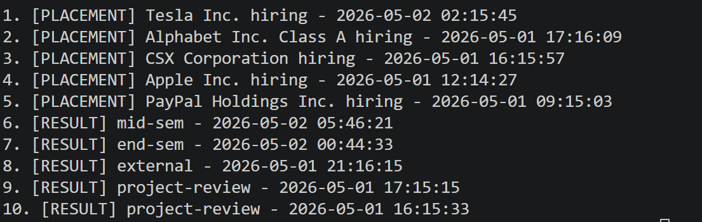

# Campus Notification System Design

## Stage 1: Priority Inbox Implementation

### Problem Statement
Users are overwhelmed by a high volume of notifications. The goal is to implement a "Priority Inbox" that displays the top 'n' (default 10) most important unread notifications.

### Priority Determination Logic
Priority is calculated using a multi-criteria weighting system:
1.  **Category Weight (Primary):**
    *   **Placement:** Weight 3 (Critical)
    *   **Result:** Weight 2 (High)
    *   **Event:** Weight 1 (Normal)
2.  **Recency (Secondary):**
    *   For notifications with the same category weight, the one with the more recent timestamp (`createdAt`) is prioritized.

### Implementation Strategy: Priority Scoring
To maintain the top 10 efficiently, we use a **Priority Score** formula:
$$Score = (Weight \times 10^{13}) + Timestamp_{unix}$$

By multiplying the weight by a factor significantly larger than any current timestamp, any notification that appears more recently within the same category will outrank the older one, for eg : If a newer placement notification comes, it will outrank older ones and be placed at the top, if a newer event notification comes, it will be placed at the top of the events category but not at the top of the entire notfications list.

### Data Structure & Efficiency
*   **Current implementation:** For batch processing, an $O(M \log M)$ sorting approach is used.
*   **Stream Maintenance (Proposed):** To handle a continuous stream of incoming notifications, I would use a **Min-Heap (Priority Queue)** of size 10.
    *   When a new notification arrives:
        1.  Calculate its Priority Score.
        2.  If the heap size < 10, add it.
        3.  If the heap is full, compare the new score with the heap's minimum element (the lowest priority in the top 10).
        4.  If the new score is higher, replace the minimum and re-heapify.
    *   This ensures $O(\log N)$ maintenance for every new notification, where $N$ is 10.

### Scalability
Since $N$ (the number of displayed notifications) is typically small (10, 20, 50), the heap-based approach fits entirely in memory and is extremely fast, making it suitable for high-frequency notification streams.

### Priority Inbox Output
The following screenshot demonstrates the prioritized notifications fetched from the API, showing the top 10 arranged by category (Placement > Result > Event) and recency:

